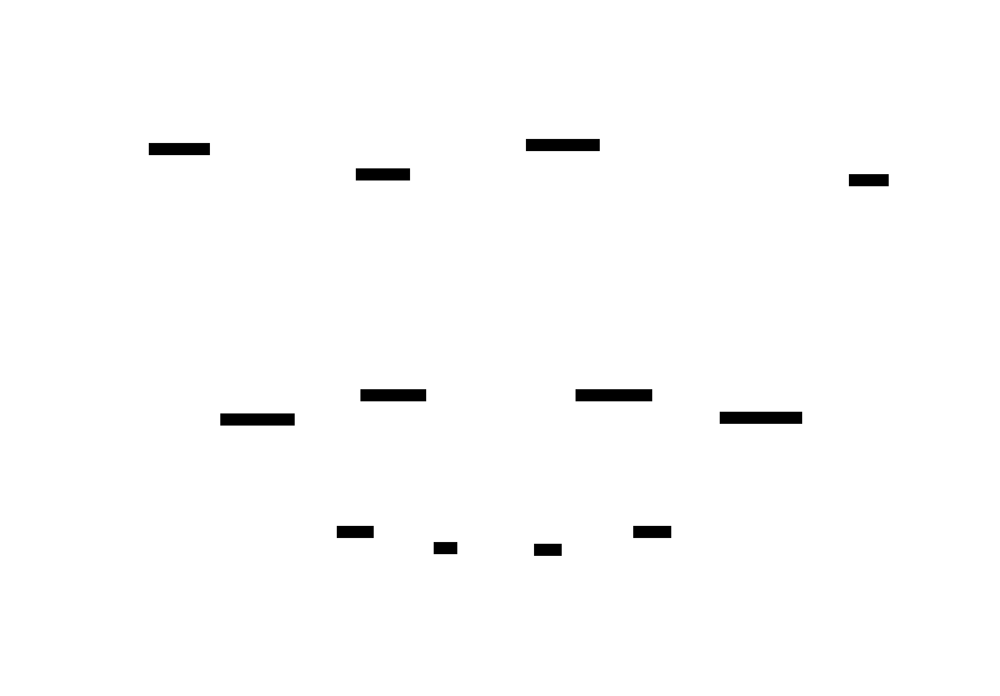

## Jeff Krueger

Senior cybersecurity architect.  30 years building and breaking security programs across DoD and the Intelligence Community.  Currently focused on agentic AI security and Zero Trust architecture.

I work at the intersection of technical depth and policy impact.  The frameworks that practitioners and policymakers need for securing agentic AI systems mostly don't exist yet.  That's what I'm working on.

---

### A Personal AI Assistant Built on Claude Code

The repos below are the components of a personal AI assistant I built and run daily.  The whole system runs inside a standard Claude Pro/Max subscription.  No external LLM services, no self-hosted models, no separate API keys beyond what Claude Code provides natively.

The design thesis is simple: **use Claude's frontier models for everything, and let Claude Code's existing infrastructure handle the orchestration.**  Scheduled tasks replace cron.  File-based storage (YAML, Markdown) replaces databases.  Skills and CLAUDE.md files replace configuration management.  The result is an assistant that gathers my morning briefing, tracks my projects, manages a persistent knowledge base across sessions, and delivers everything through Discord, email, push notifications, and TTS audio.

These aren't packages you `pip install`.  They're reference architectures.  Point Claude at any of these repos and ask it to evaluate the approach and build something similar for your needs.  Claude has the context to understand what each component does and adapt it.

**Why this approach over open-source agent frameworks:**

- **Model quality.**  Claude Opus and Sonnet outperform the smaller models that open-source frameworks typically target.  The briefing pipeline's news curation, the reconciliation engine's backlog parsing, the brain's knowledge extraction all depend on reasoning that smaller models struggle with.
- **Security.**  There's no attack surface to manage.  No exposed API endpoints, no credential management beyond OS keyring, no Docker containers to patch.  Claude Code runs locally.  Scheduled tasks run on Anthropic's infrastructure with pre-approved tool permissions.
- **Simplicity.**  The entire assistant is files on disk plus scheduled task prompts.  No framework dependencies, no orchestration layer, no message queues.  If something breaks, you read the markdown prompt and fix it.

---

### The Components

#### Delivery and Notification
**[claude-notify](https://github.com/JAKSecurity/claude-notify)** sends messages through Discord webhooks, email (SMTP), push notifications (ntfy.sh), and generates TTS audio from markdown.  Shared secret management via OS keyring.  Every other component that needs to deliver output uses these scripts.

#### Morning Briefing Pipeline
**[claude-briefing](https://github.com/JAKSecurity/claude-briefing)** is a multi-stage pipeline that runs every morning as Claude Code scheduled tasks.  Three independent gatherers (weather from NWS, news with a rotating deep-dive topic, local project status) write staging files in parallel.  An assembler combines them into a markdown briefing, generates an MP3 via TTS, and delivers through all channels.  A watchdog task runs 17 minutes later to recover from partial failures.  The pipeline has been running daily since March 2026.

#### Cross-Project Knowledge Base
**[claude-brain](https://github.com/JAKSecurity/claude-brain)** solves the problem of knowledge loss between Claude sessions.  Three layers: curated brain entries (decisions, patterns, insights) with a YAML index for fast lookup, verbatim transcript archival via daily scheduled task, and a SessionStart hook that auto-injects recent context when you open a new session.  50+ entries across 8 projects, 250+ archived transcripts.  The index-first search pattern keeps context windows lean.

#### Project Tracking and Dashboard
**[claude-tracking](https://github.com/JAKSecurity/claude-tracking)** implements a 4-tier tracking system: Strategic goals > Projects > Capabilities > Work Items.  A Node.js dashboard (localhost:3000) provides the visual interface.  A daily reconciliation engine crawls every project's backlog, auto-scores health (hot/warm/stale/cold), auto-promotes capabilities when their work items complete, and generates nudges for the morning briefing.  GitHub Projects sync keeps an external mirror up to date.

---

### How They Connect

Claude Code sits at the top as both the runtime and the reasoning engine.  The three automation systems — brain, tracking, briefing — each run as scheduled Claude tasks and all route their output through **claude-notify**, the shared delivery substrate.  **SPECTRA** is a standalone pipeline that collects from 17 public sources and also delivers via claude-notify.  The connective tissue is all file-based: `projects.yaml` for project state, brain entries with a YAML index, staging files between pipeline stages.  No message queues, no databases, no API contracts between services.

---

### Other Public Repos

| Repo | What it is |
|------|------------|
| **[SPECTRA](https://github.com/JAKSecurity/SPECTRA)** | Automated monthly cybersecurity policy digest.  Collects from 17 RSS/API sources, curates with Claude, renders to PDF.  984 lines, 59 tests, MIT licensed. |

---

### What I'm Working On

**Agentic AI security frameworks.**  Mapping NIST SP 800-53, SP 800-207 (Zero Trust Architecture), and the AI Risk Management Framework onto multi-agent deployment patterns.  I submitted an RFI response to NIST on agentic AI security in March 2026 and built a control-by-control 800-53 overlay for agentic systems.

**cATO Lab.**  A public research environment for continuous Authorization to Operate (cATO) automation.  Two-agent crew validates security controls against synthetic RMF targets with per-agent identity, explicit authorization at every phase, and hash-chained audit.  Portfolio writeup coming soon.

---

### Background

Army Signal Corps Officer through Cyber Warfare Officer.  Army Red Team.  Full-spectrum cyber and information warfare assessments across DoD commands.  NSA Red Team Boot Camp.

Booz Allen Hamilton since 2008.  Zero Trust programs, enterprise security architecture, CIO/CISO advisory.

The problems I'm working on now are the same ones I've watched persist for 30 years.  Agentic AI is the current front.
